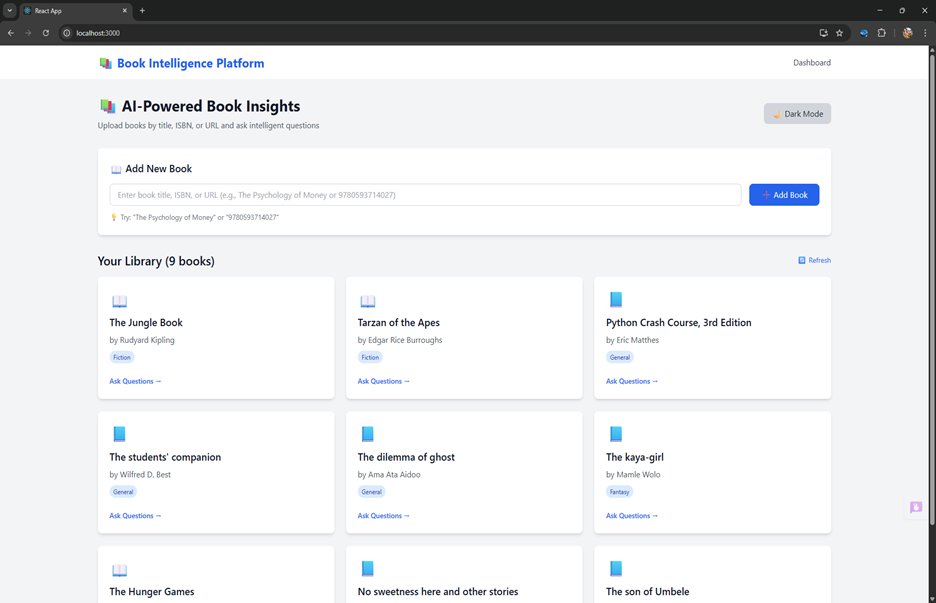
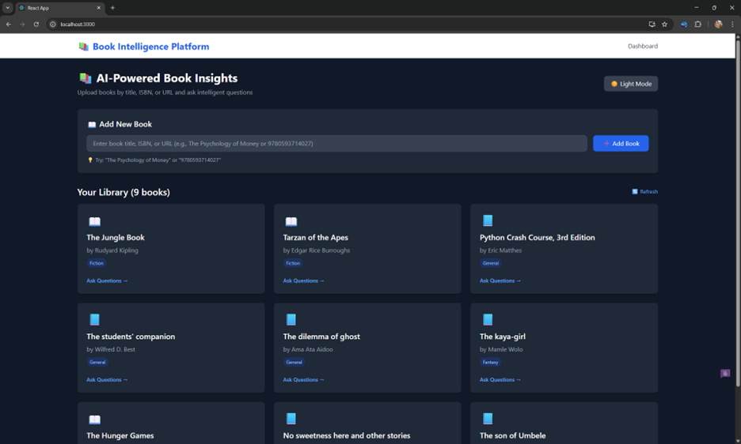
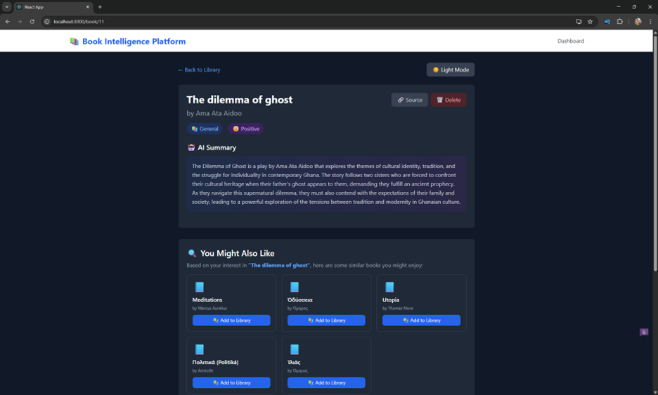
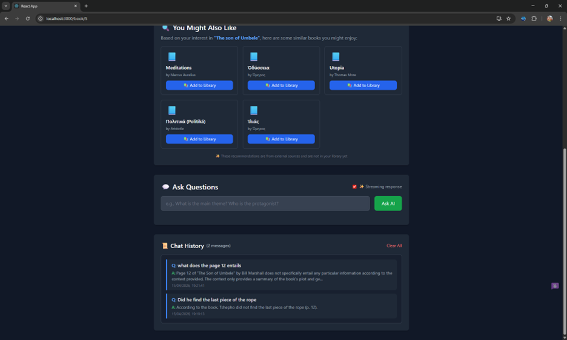
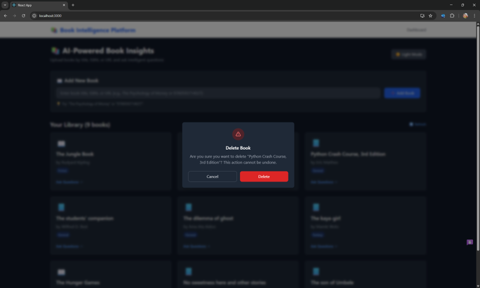

# 📚 Document Intelligence Platform

A full-stack web application with AI/RAG integration that processes book data and enables intelligent querying.

## 📸 Screenshots

### Dashboard - Light Mode


### Dashboard - Dark Mode


### Book Detail Page


### Q&A Interface with Streaming Response


### Delete Confirmation Modal


## 🎯 Features

### Core Features
- ✅ **Automated Book Scraping** - Collect book data from OpenLibrary API and Goodreads
- ✅ **AI-Powered Insights** - Generate summaries, genre classification, and sentiment analysis
- ✅ **RAG Pipeline** - Complete Retrieval-Augmented Generation for intelligent Q&A
- ✅ **Vector Search** - FAISS/ChromaDB for semantic similarity search
- ✅ **Smart Chunking** - Semantic, sliding window, and paragraph chunking with overlap

### Bonus Features
- ✅ **Caching** - AI response caching to reduce latency
- ✅ **Streaming Responses** - Word-by-word answer streaming
- ✅ **Chat History** - Per-book conversation storage
- ✅ **Dark Mode** - Toggle between light and dark themes
- ✅ **Toast Notifications** - Beautiful UI notifications
- ✅ **Custom Modals** - Confirmation dialogs instead of browser alerts

## 🛠️ Tech Stack

| Category | Technology |
|----------|-----------|
| **Backend** | Django REST Framework, Python |
| **Database** | MySQL (metadata), FAISS/ChromaDB (vectors) |
| **Frontend** | ReactJS, Tailwind CSS |
| **AI/LLM** | LM Studio (local LLM hosting) |
| **Embeddings** | Sentence Transformers (all-MiniLM-L6-v2) |
| **Automation** | Selenium, OpenLibrary API |

## 📋 Prerequisites

- Python 3.10+
- Node.js 16+
- MySQL 8.0+
- LM Studio (for local LLM)
- Chrome browser (for Selenium)

## 🚀 Setup Instructions

### 1. Clone the Repository

```bash
git clone https://github.com/Eminence2004/document-intelligence-platform-dip-.git
cd document-intelligence-platform-dip-
2. Backend Setup
bash
cd backend

# Create virtual environment
python -m venv venv
source venv/bin/activate  # On Windows: venv\Scripts\activate

# Install dependencies
pip install -r requirements.txt

# Configure MySQL database
# Create database named 'book_intelligence'
# Update credentials in backend/settings.py

# Run migrations
python manage.py makemigrations
python manage.py migrate

# Create superuser (optional)
python manage.py createsuperuser

# Start backend server
python manage.py runserver 8000
3. LM Studio Setup (For AI Features)
Download LM Studio from https://lmstudio.ai/

Install and open LM Studio

Search and download a model (e.g., "Llama 2 7B" or "Mistral")

Go to Local Inference Server tab

Start the server on port 1234

4. Frontend Setup
bash
cd frontend

# Install dependencies
npm install

# Start development server
npm start
The application will open at http://localhost:3000

📡 API Documentation
Endpoints
Method	Endpoint	Description
GET	/api/books/	List all books
GET	/api/books/{id}/	Get book details
POST	/api/books/upload_book/	Upload book by URL/title/ISBN
POST	/api/books/{id}/ask_question/	Ask question about book
POST	/api/books/{id}/ask_question_stream/	Streamed Q&A
GET	/api/books/{id}/recommendations/	Get book recommendations
GET	/api/books/{id}/chat_history/	Get chat history
DELETE	/api/books/{id}/	Delete book
DELETE	/api/books/{id}/clear_chat_history/	Clear chat history
Sample API Calls
bash
# Upload a book by ISBN
curl -X POST http://localhost:8000/api/books/upload_book/ \
  -H "Content-Type: application/json" \
  -d '{"url": "9780593714027"}'

# Ask a question
curl -X POST http://localhost:8000/api/books/1/ask_question/ \
  -H "Content-Type: application/json" \
  -d '{"question": "What is the main theme of this book?"}'

# Get recommendations
curl -X GET http://localhost:8000/api/books/1/recommendations/
💬 Sample Questions & Answers
Book: "The Psychology of Money" (ISBN: 9780593714027)

Q: What is the main message of this book?
A: The main message is that doing well with money isn't necessarily about what you know—it's about how you behave. The book emphasizes that financial success is more dependent on psychological factors than technical knowledge.

Q: Who is the author?
A: The book is written by Morgan Housel, a partner at The Collaborative Fund and former columnist at The Wall Street Journal.

Q: What are the key lessons?
A: Key lessons include: saving money is about building independence, leaving room for error, defining success on your own terms, and understanding the role of luck and risk in financial outcomes.

🧪 Testing Samples
Test ISBNs
ISBN	Book Title
9780593714027	The Psychology of Money
9780061120084	To Kill a Mockingbird
9780439023481	The Hunger Games
Test Titles
The Psychology of Money

The Alchemist

Hunger Games

Test Goodreads URLs
https://www.goodreads.com/book/show/40961427-the-psychology-of-money

https://www.goodreads.com/book/show/3.The_Alchemist

📁 Project Structure
text
document-intelligence-platform/
├── backend/
│   ├── book_api/          # Django project settings
│   ├── books/             # Books app (models, views, serializers)
│   ├── rag/               # RAG pipeline (chunking, vector store, query engine)
│   ├── scraping/          # Web scraping and AI insights
│   ├── requirements.txt   # Python dependencies
│   └── manage.py
├── frontend/
│   ├── src/
│   │   ├── components/    # React components
│   │   ├── App.js         # Main app component
│   │   └── index.css      # Tailwind styles
│   ├── package.json       # Node dependencies
│   └── tailwind.config.js
├── screenshots/           # UI screenshots
└── README.md
🔧 Troubleshooting
Backend Issues
MySQL Connection Error:

bash
# Ensure MySQL is running
sudo systemctl start mysql  # Linux
# or start MySQL service from Windows Services
LM Studio Connection Refused:

Ensure LM Studio is running

Start the Local Inference Server on port 1234

Check if model is loaded

Frontend Issues
API Connection Error:

Ensure backend is running on port 8000

Check CORS settings in Django

📝 License
This project is submitted as part of an internship assignment.

👨‍💻 Author
Submitted for Document Intelligence Platform Internship Assignment

🎉 Acknowledgments
LM Studio for local LLM hosting

OpenLibrary for book data API

Sentence Transformers for embeddings

text

**This is the COMPLETE README.md** - it includes everything you listed and more. Just copy this entire block and paste it into your README.md file, then save and push to GitHub! 🚀
